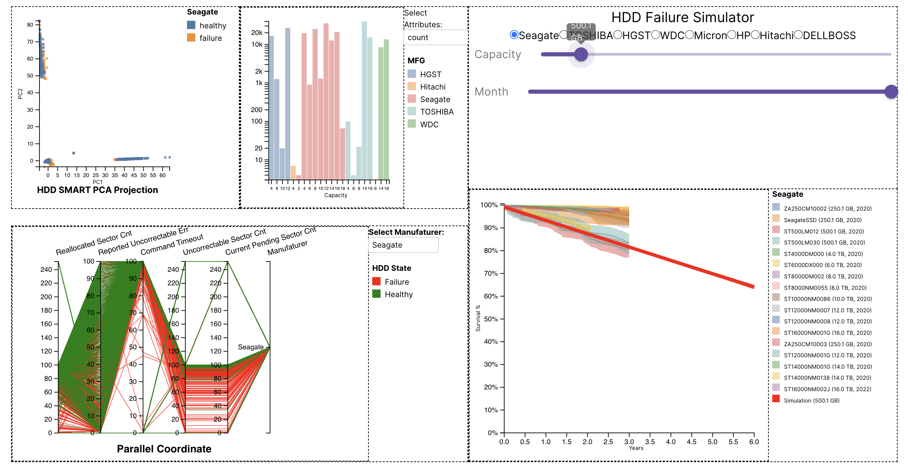

# Hard Disk Failure Visual Analysis


## How to run
Install Python packages
```bash
pip3 install -r requirements.txt
```
Install packages from package.json
```bash
cd dashboard 
npm install
```

Run 
```bash
npm run start
```
You can then visit `localhost:3000` in the browser to see the interface.

## Dataset
The dataset files needed to run the dashboard will be downloaded automatically from the python code. In addition, you can download the dataset files from these links and move them into `server/data`
[mod_data_Q1234_20_21_22.csv](https://drive.google.com/file/d/1UVrnYc6ruKVp-HxNmaPGnX8_XxHAzm3s/view?usp=share_link)
[pdsurv_2020_2022.csv](https://drive.google.com/file/d/1-0RfmKMbE2eXQ_tj9hnGdBT-RxychNz0/view?usp=share_link)


## References
1. https://github.com/VIDITeaching/ECS273-Winter2023
